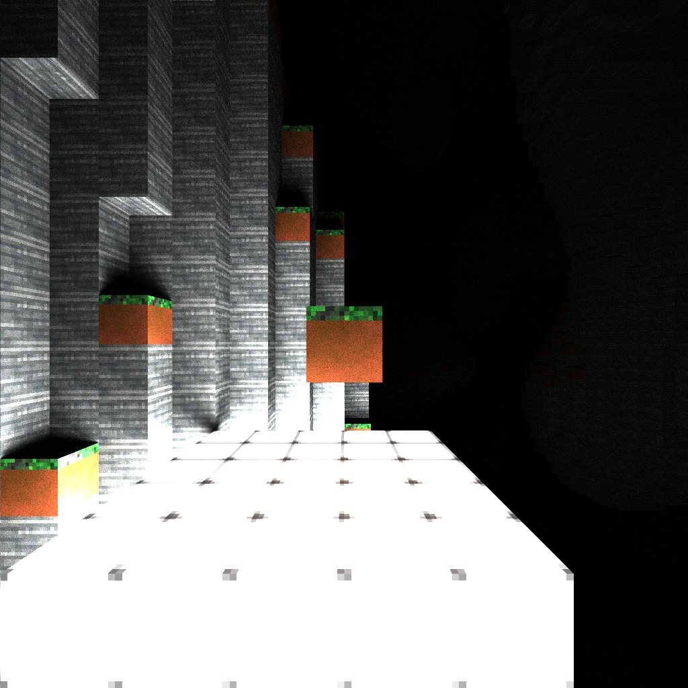
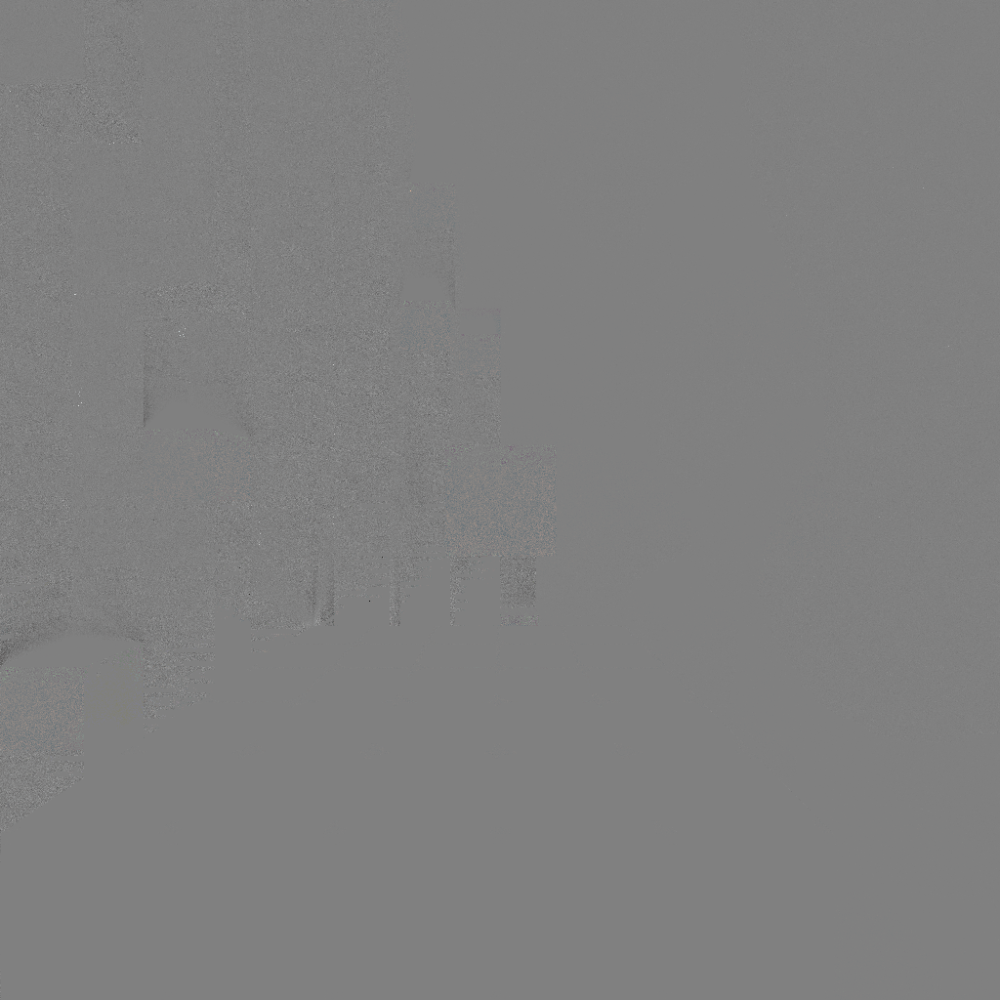

# Vulkan RESTIR-GI Voxel Renderer

Things that work:
- [x] Benchmarking: press PrintScreen to benchmark between two different rendering methods at high SPP.
- [x] Spatial Reuse: Spatial reuse basically works.
- [x] NEE: Spatial Reuse correctly works with NEE. We used a mixed PDF system for NEE, just like Ray Tracing in One Weekend. Therefore, Restir GI works out of the box with it, and it boosts perf significantly.
- [x] Spatial Reuse Unbiasedness: We implement the unbiased version of Restir, including visibility checks. Does it work in practice? 99% yes, but there are a few places where I am a little bit suspicious. These aren't noticeable in practice however. I'm pretty sure they're because of the jacobian.

Things that still need work:
- [ ] Temporal Reuse: not implemented yet, need camera tracking and such.
- [ ] M-capping. This isn't implemented in the original Restir GI paper, but I'd like to implement M-capping to prevent artifacts.
- [ ] Delaying Reconnection shifts on specular and transparent surfaces: Right now we always do the Restir pass, even if the surface is specular. In fact, if you look at the restir_finalize shader, we even assume that every surface is lambertian (which isn't true). Ideally, we would delay the reconnection until we find a rough surface to bounce off of.

## Controls

| Key | Action |
|-----|--------|
| W/A/S/D | Move forward/left/back/right |
| Space / Shift | Move up / down |
| Arrow keys | Look around |
| Mouse left | Break block |
| Mouse right | Place block |
| 1 | Select glass |
| 2 | Select grass |
| 3 | Select lamp |
| 4 | Select mirror (default) |
| 5 | Select soil |
| 6 | Select stone |
| 7 | Select texturetest |
| N | Cycle NEE mode (off / on / bounce 0 only) |
| R | Cycle ReSTIR spatial iterations (0 / 1 / 3 / 5 / 10) |
| B | Cycle debug view |
| O | Toggle ray sort |
| Tab | Toggle physics mode |
| PrintScreen | Run benchmark |

## Is it Unbiased?

I'm like 95% sure it's unbiased! Look at these pair of images:

<table>
<tr>
<td> Ground truth (high SPP vanilla PT)</td>
<td> ReSTIR GI (same SPP budget)</td>
</tr>
</table>

Absolute difference:

It looks like there are some very subtle shading differences, especially around the shadows. I'm pretty sure these have to do with the jacobian being clamped.

### Notes
* Unfortunately the notation is a bit all over the place. This is a consequence of the ReSTIR notation being pretty inconsistent, as well as the general raytracer formulation being inconsistent. My main inspirations have been:
  * https://raytracing.github.io/
  * https://research.nvidia.com/publication/2021-06_restir-gi-path-resampling-real-time-path-tracing
    * The main algorithm in use is here. 
  * https://intro-to-restir.cwyman.org/presentations/2023ReSTIR_Course_Notes.pdf 
    * I use their notation for the reservoirs. Specifically, I use `c` for what Restir GI calls `M`, and `W_Y` for what Restir GI calls `ucw`. 
    * I eventually intend to implement this.
  * https://dl.acm.org/doi/epdf/10.1145/3386569.3392481 
    * You should definitely read this if you're confused about what the `Z` variable does in Restir GI.  